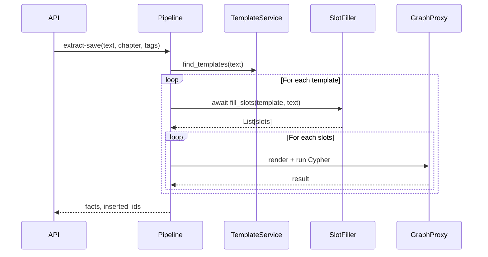

# 📘 Техническое задание: Компонент `SlotFiller` (StoryGraph)

## 📌 Назначение

`SlotFiller` — компонент, отвечающий за извлечение структурированных значений слотов из свободного текста на основе шаблона `CypherTemplate`. Он реализует ключевую часть пайплайна `/v1/extract-save`.

Компонент выполняет:
- Прямую LLM-экстракцию (`extract`)
- Повторное уточнение (`fallback`)
- Генерацию свободных полей (`generate`)
- Возврат **одного или нескольких** наборов заполнений (multi-match)

---

## 🧠 Контекст в архитектуре

### Позиция в пайплайне:



### Используемые компоненты:
- `LangChain + OpenAI` (Structured Output)
- `Langfuse` — для логирования и трассировки
- `pydantic` — для валидации `slot_schema`
- `CypherTemplate` — схема шаблона из Weaviate

---

## 🧾 Интерфейс

```python
async def fill_slots(
    self, template: CypherTemplate, text: str
) -> List[Dict[str, Any]]:
    ...
```

Для обратной совместимости доступна синхронная обёртка
``call_llm_with_json_list_sync``.

### Аргументы:
- `template` — экземпляр `CypherTemplate` с описанием `slots`
- `text` — фрагмент текста (2–8 предложений)

### Возвращает:
Список словарей, каждый из которых содержит значения слотов, заполняемых в шаблон.

---

## 🧩 Поведение по шагам

### 1. Инициализация
- Инициализация LangChain Structured Output Parser
- Привязка схемы к `slot_schema` (`List[SlotDefinition]`)

### 2. Генерация промпта
- Автоматическая генерация промпта на основе `slot_schema`
- Добавление описаний и типов в system / user prompt

### 3. Вызов LLM
- Использование OpenAI (ChatModel) с высокой температурой
- Парсинг строго структурированного JSON (через LangChain)

### 4. Валидация результата
- Проверка каждого словаря:
  - Все `required` поля присутствуют
  - Приведение типов (`STRING`, `INT`, `FLOAT`, `BOOL`)
  - Значения в пределах разумных/описанных

### 5. Обработка множественных заполнений
- Поддержка множественных блоков фактов (multi-match)

### 6. Fallback / Generate
- Если `required` поле отсутствует:
  - Повторный запрос с уточнением (fallback)
- Если поле `required=False`, но важно (e.g. `summary`) → генерация

---

## 📦 Используемые модели

```python
class SlotDefinition(BaseModel):
    name: str
    type: Literal["STRING", "INT", "FLOAT", "BOOL"]
    description: Optional[str] = None
    required: bool = True
    default: Optional[Union[str, int, float, bool]] = None

class CypherTemplate(BaseModel):
    id: str
    title: str
    description: str
    category: Optional[str]
    slots: List[SlotDefinition]
    graph_relation: Optional[GraphRelationDescriptor]
    cypher: str
```

---

## 📤 Примеры вывода

### Пример: Разрыв и вступление в фракции

**Текст:**
> «В главе 15 Арен разрывает клятву с Домом Зари, заявляя, что их учения были ложью. Он теперь открыто симпатизирует Северному фронту.»

**Шаблон:** `CypherTemplate(slots=[character, faction])`

**Ожидаемый результат:**
```json
[
  {"character": "Арен", "faction": "Дом Зари"},
  {"character": "Арен", "faction": "Северный фронт"}
]
```

---

## 🛡️ Обработка ошибок

- Неверный JSON от LLM → повторный запрос (1 попытка)
- Отсутствие `required` полей → fallback генерация
- Ошибки парсинга / типизации → исключение с логированием
- В случае полной неудачи — возвращается `[]`

---

## 📈 Метрики и отладка

- `%` успешных извлечений
- Среднее число заполнений на шаблон
- Число fallback/generative случаев
- Полнота покрытия `required` слотов

---

## 🧪 Тестирование

- Тесты на:
  - одно и несколько заполнений
  - fallback / generate логику
  - валидацию по slot_schema
  - корректность типов
  - поведение при ошибках JSON

---

## 🧩 Расширяемость

- Возможность заменить OpenAI → Anthropic, Mistral
- Расширение типов (`DATE`, `SUMMARY`, `LIST`)
- Возможность подстановки контекста из графа

---

## 🧷 Ссылки на спецификации

- `README.md`: секция «Slot Filling Logic»
- `pydantic_models_for_cypher_template.md`: модели шаблонов и связей
- `pipeline_overview.md`: общая схема пайплайна

---