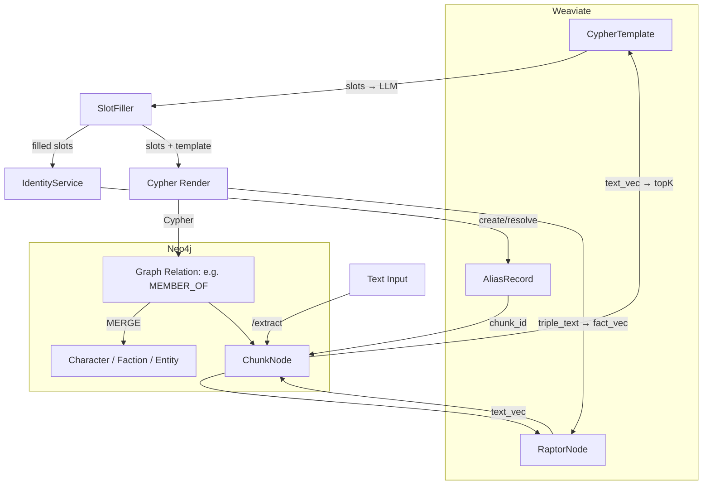

Вот обобщение того, как работает обновлённый пайплайн в `narrator-service`, с фокусом на взаимодействие между объектами:

---

## ✅ Ключевые сущности пайплайна

### 1. `ChunkNode` (в Neo4j)
- Представляет текстовый фрагмент.
- Хранит: `text`, `chapter`, `tags`, `draft_stage`, `raptor_node_id`.
- Связывает: все сущности и связи, извлечённые из текста.

### 2. `CypherTemplate` (в Weaviate)
- Jinja2-шаблон для генерации доменных связей.
- Содержит:
  - `slots` — описание входных данных.
  - `graph_relation` — описание семантики (`subject`, `predicate`, `object`).
  - `extract_cypher` / `augment_cypher` — Jinja2-файлы для вставки и выборки.
  - `use_base_extract` / `use_base_augment` — подключают обёртку `chunk_mentions.j2`.

### 3. `AliasRecord` (в Weaviate)
- Отражает конкретное текстовое упоминание сущности.
- Используется для identity resolution.
- Связан с `ChunkNode` через `chunk_id`.

### 4. `RaptorNode` (в Weaviate)
- Представляет смысловую кластеризацию фрагментов.
- Хранит два вектора:
  - `text_vec` — эмбеддинг текста.
  - `fact_vec` — эмбеддинг триплета (из `graph_relation`).
- `centroid = α·text_vec + β·fact_vec`
- Связан с `ChunkNode` через `chunk.raptor_node_id`.

---

## 🔄 Связи между сущностями

### 💬 От текста к графу:

1. **Text → ChunkNode**  
   `/v1/extract-save` получает текст и метаданные. Создаётся `ChunkNode`.

2. **ChunkNode → Templates**  
   По `text_vec` находится top-K `CypherTemplate` из Weaviate (TemplateService).

3. **Template → Slots**  
   `SlotFiller` вызывает LLM для заполнения `slots`, основанных на схеме шаблона.

4. **Slots → Aliases**  
   `IdentityService` находит или создаёт entity_id для всех `is_entity_ref` слотов.  
   → Создаются `AliasRecord` (Weaviate), содержащие `chunk_id`.

5. **Slots + Template → Cypher**  
   `template.render(slots, chunk_id)` → генерирует `content_cypher`.  
   `chunk_mentions.j2` вставляет `MATCH (chunk)`, `MENTIONS`.

6. **Cypher → Graph**  
   `GraphProxy` выполняет `content_cypher` в Neo4j.  
   Создаются `Character`, `Faction`, `MEMBER_OF`, `MENTIONS`.

7. **ChunkNode → RaptorNode**  
   Вызывается `flat_raptor.insert_chunk()`:  
   - Считаются `text_vec`, `fact_vec`, `centroid`
   - Возвращается `raptor_node_id`
   - Обновляется поле `chunk.raptor_node_id`

---

## 🧠 Объекты и зачем они нужны

| Объект        | Где хранится  | Назначение                                                                 |
|---------------|---------------|----------------------------------------------------------------------------|
| `ChunkNode`   | Neo4j         | Привязка всех извлечённых сущностей к одному текстовому фрагменту         |
| `CypherTemplate` | Weaviate    | Генерация графа: какие сущности, как связаны, с каким описанием           |
| `AliasRecord` | Weaviate      | Обеспечивает identity resolution и отслеживание упоминаний                |
| `RaptorNode`  | Weaviate      | Кластеризация, агрегация и последующий версионинг по смысловой близости   |

---

## 🧩 Роль `chunk_id`

- Передаётся в `template.render(...)` для генерации `MATCH (chunk)`, `MERGE (chunk)-[:MENTIONS]->(...)`.
- Присутствует в:
  - `Cypher` шаблонах
  - `AliasRecord`
  - `ChunkNode.raptor_node_id`
- Делает все сущности трассируемыми от исходного текста.

---

## 📊 Схема пайплайна (в текстовом виде)

Если хочешь, могу отрисовать эту схему как SVG или доработать под конкретный use-case.

