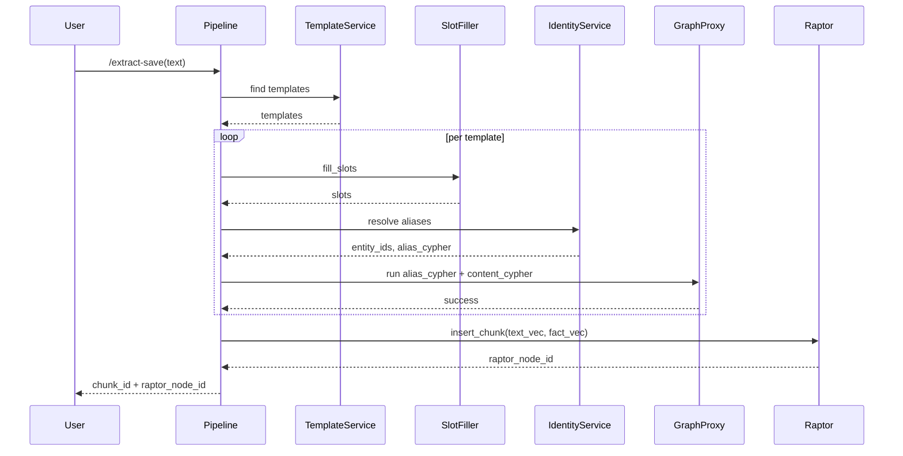

# 🧠 Raptor Pipeline Architecture (обновлённая версия)

Цель пайплайна — извлекать структурированные связи из текста и сразу сохранять их в граф (Neo4j), а затем группировать фрагменты по смысловой близости через `RaptorNode`.

---

## 🔄 Основные компоненты

1. **TemplateService** – поиск подходящих `CypherTemplate` по `text_vec`.
2. **SlotFiller** – заполнение слотов LLM и валидация по `slot_schema`.
3. **IdentityService** – сопоставление имён с `entity_id`, создание `AliasRecord`.
4. **TemplateRenderer** – рендер контентного Cypher (`base_fact.j2` добавляет `MENTIONS`).
5. **GraphProxy** – выполнение Cypher и создание узлов/связей в Neo4j.
6. **FlatRaptorIndex** – вычисление `text_vec` и `fact_vec`, формирование или обновление `RaptorNode`.

---

## 📌 Поток выполнения

---

## 🧠 Для чего нужен `RaptorNode`

- **Кластеризация фрагментов.** Каждому чанку вычисляются `text_vec` и `fact_vec` (из `graph_relation`). Их смесь формирует `centroid`, по которому фрагмент помещается в существующий `RaptorNode` или создаётся новый.
- **Версионирование.** Вместо отдельного узла `Fact` история строится через связи `ChunkNode` → `RaptorNode`. Все рёбра содержат `chunk_id`, поэтому состояние мира в любой момент можно восстановить, выбрав связанные чанки.
- **Поиск похожих эпизодов.** Соседи `RaptorNode` позволяют быстро находить сходные сцены и повторно использовать информацию.

`RaptorNode` создаётся **после** коммита Cypher: когда все связи уже привязаны к `ChunkNode`, сервис вызывает `flat_raptor.insert_chunk()` и обновляет поле `chunk.raptor_node_id`.

---

## ✅ Минимальный пример

1. Пользователь отправляет фрагмент текста.
2. Пайплайн проходит через все перечисленные шаги и создаёт связи `MEMBER_OF` между персонажем и фракцией.
3. После успешной вставки `FlatRaptorIndex` возвращает `raptor_node_id = "rn-42"`.
4. Теперь в графе есть путь `(:RaptorNode {id: "rn-42"})<-[:FROM_RAPTOR]-(:Chunk {id: "c-1"})-[:MENTIONS]->(:Character {id: ...})`.

Этот путь используется для агрегации и анализа последующих глав.
